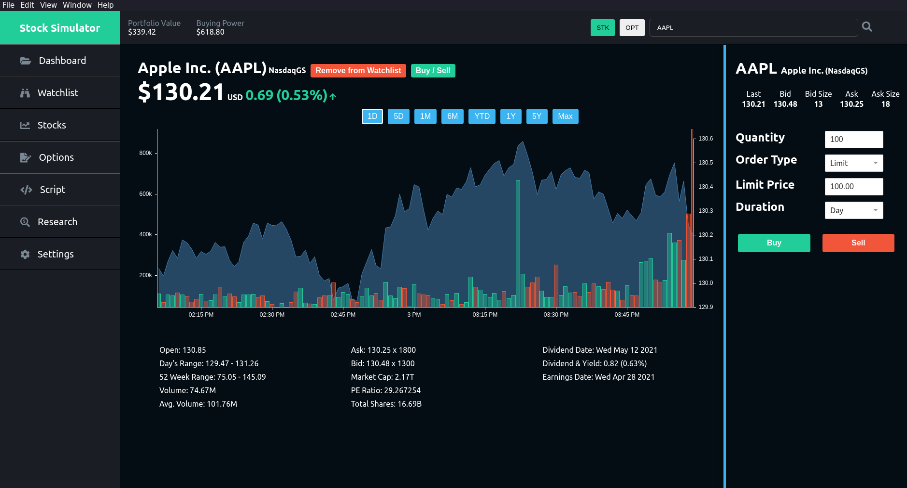

## PaperTrader




Electron based app for simulating the stock market to trade stocks in a risk-free environment.

Stock data is pulled from the [finance-go](https://piquette.io/projects/finance-go/) library.

Charts are created with [react-chartjs](https://github.com/reactchartjs/react-chartjs-2) a wrapper for Chart.js in React.

Data stored using the [electron-store](https://github.com/sindresorhus/electron-store) library.

### For Development

#### Environment Setup
You need to have [Go](https://golang.org), [Python](https://www.python.org/downloads) and [Node.js](https://nodejs.org/en/) installed 

#### Frontend
From the root directory,
```
npm install
npm run dev
```

#### Server
From the server directory,
```
go build .
./server
```
The server serves locally on http://localhost:8080.

